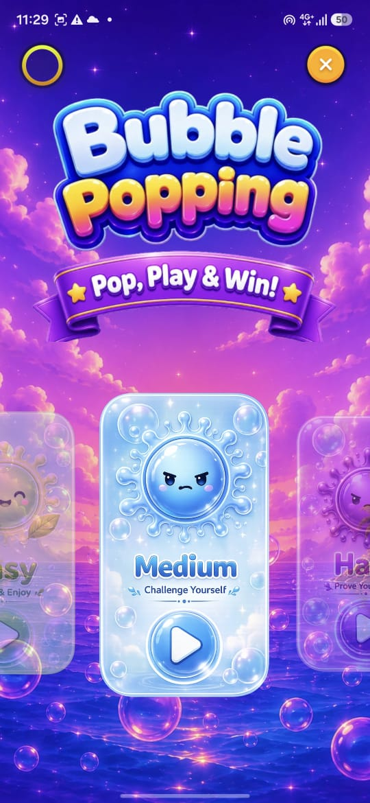
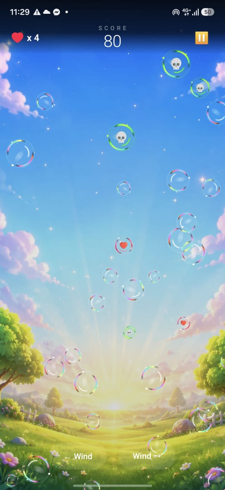
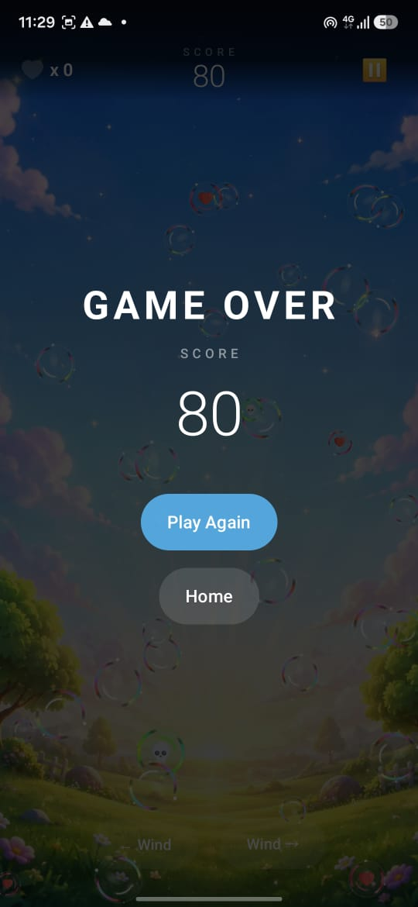

# Bubble Pop Game 🎈

A fast-paced and engaging bubble popping game built with **Jetpack Compose**, featuring smooth animations, score tracking, increasing difficulty, and responsive touch interactions.

The objective is simple—pop as many bubbles as possible before they disappear while competing for the highest score.

---

## ✨ Features

- 🎮 Simple and addictive gameplay
- 🫧 Smooth bubble spawning and animations
- 👆 Responsive touch detection
- 📈 Dynamic difficulty progression
- 🏆 Real-time score tracking
- ❤️ Lives system
- ⏸️ Pause and resume gameplay
- 🔄 Restart game instantly
- 🎨 Modern UI built with Jetpack Compose
- 📱 Optimized for different Android screen sizes

---

# 🏗️ Architecture

The project follows **MVVM** architecture with a clear separation of concerns.

```
Presentation
    ↓
ViewModel
    ↓
Game Engine
    ↓
State Management
```

The UI is fully built using **Jetpack Compose**, while game logic is managed through immutable state and Kotlin Coroutines.

---

# 🛠️ Tech Stack

### Language

- Kotlin

### UI

- Jetpack Compose
- Material Design 3

### Architecture

- MVVM
- State Management
- Unidirectional Data Flow

### Async

- Kotlin Coroutines
- StateFlow

---

# 🎯 Gameplay

- Tap bubbles before they disappear.
- Earn points for every successful pop.
- Missing bubbles costs lives.
- Difficulty increases over time with faster and more frequent bubbles.
- Achieve the highest score possible.

---

# 🚀 Future Improvements

- Sound effects
- Background music
- Combo multiplier
- Power-ups
- Leaderboard
- Achievements
- Multiple game modes
- Particle explosion effects
- Haptic feedback

---

# 📸 Screenshots

<p align="center">
  <table>
    <tr>
      <td align="center">
        <b>Home Screen</b><br>
        
      </td>
      <td align="center">
        <b>Game Play</b><br>
        
      </td>
      <td align="center">
        <b>Game Over</b><br>
        
      </td>
    </tr>
  </table>
</p>
---

# 🤝 Contributing

Contributions, issues, and feature requests are welcome.

Feel free to fork the repository and submit a pull request.

---

# 📄 License

Licensed under the MIT License.
